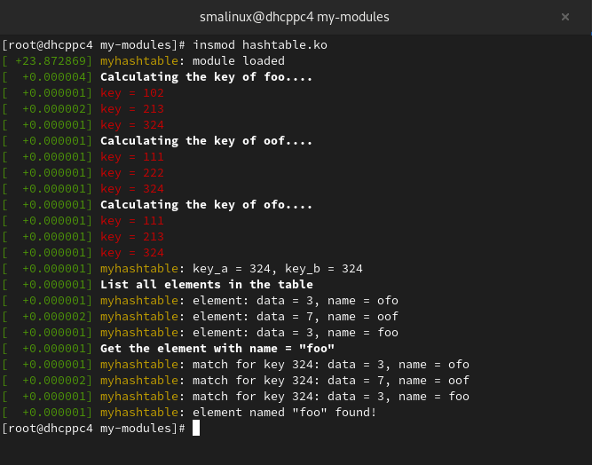
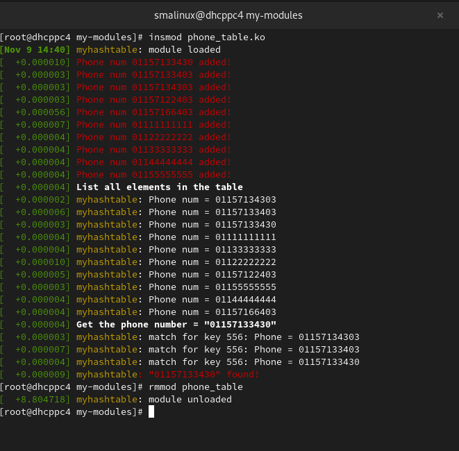
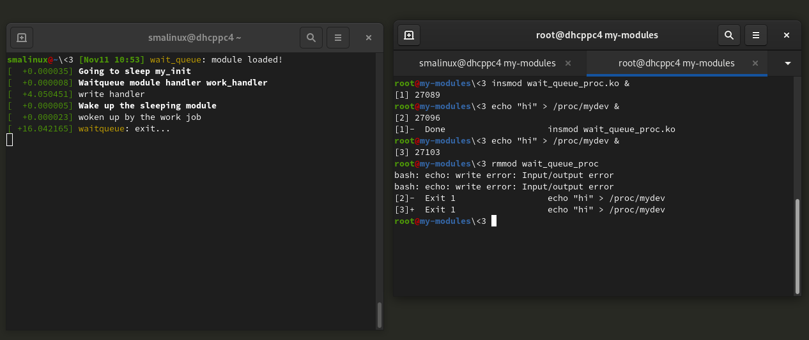
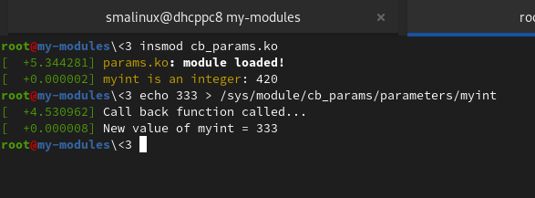
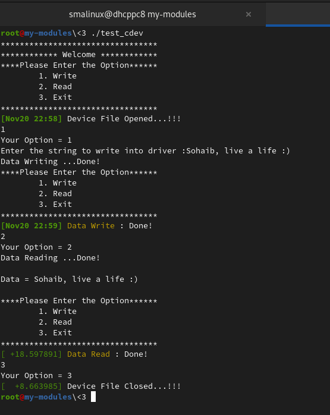

# lab
#### link:../main/container_of.c[container_of.c] dmesg
image:images/container_of.png[alt text]

#### link:../main/container_of_container_of.c[container_of_container_of.c] dmesg
image:images/container_of_container_of.png[alt text]

#### link:../main/list.c[list.c] dmesg
image:images/list.png[alt text]

#### link:../main/hashtable.c[hashtable.c] dmesg

#### link:../main/phone_table.c[phone_table.c] dmesg

#### link:../main/wait_queue_proc.c[wait_queue_proc.c] dmesg

#### link:../main/params.c[params.c]
Passing Arguments to Device Driver. like: argc & argv

use:
[source,bash]
----
$ insmod params.ko myshort=5 myint=100 mystring="Sohaib" myintArray=3,7
----

#### link:../main/cb_params.c[cb_params.c]
Register the callback whenever the argument (parameter) got changed. 
----
$ insmod cb_params.ko myint=50
$ echo 333 > /sys/module/cb_params/parameters/myint
----

#### link:../main/cdev.c[cdev.c]
Complete char device driver.

to test the driver use: 
----
$ ./test_cdev
----

#### link:../main/sys_fs.c[sys_fs.c]
What's sys fs as a system admin?

see Documentation/filesystems/sysfs.rst

How to use:
----
$ insmod sys_fs.ko
$ ls /sys/kernel/sma_sysfs/
$ cat /sys/kernel/sma_sysfs/sma_value
$ echo 44 > /sys/kernel/sma_sysfs/sma_value
$ cat /sys/kernel/sma_sysfs/sma_value
$ rmmod sys_fs
----

